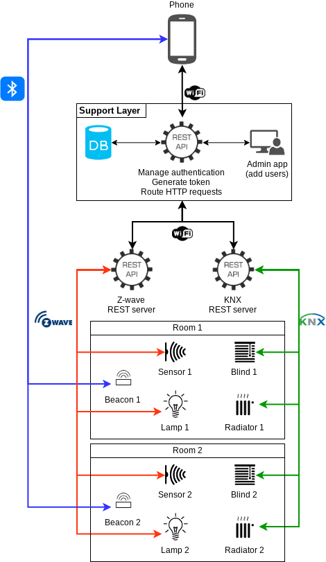

# Sécurité

En terme de sécurité, nous avons choisi d'utiliser l'authentification + tokens et d'ajouter une couche supplémentaire *Support Layer*. Cette couche est responsable de gérer la gestion d'authentification et de générer le token, et après le diffuser vers tous les serveurs du réseau. Dans notre solution, le Support Layer est une couche d'abstraction qui permet d'acheminer les routes HTTP demandées par l'application mobile cliente. 

Avec cette méthode, et au moment de l'ajout de nouveaux device(s) avec un serveur REST, on aura juste à effectuer la liaison avec le Support Layer, et ajouter le(s) device(s) en question dans la vue de l'application cliente.

* L'application *Admin app* a pour rôle de créer les comptes utilisateurs, ça veut dire ajouter des utilisateurs (user + password) dans la base de données.
* Une fois le compte utilisateur est créé, un token va être généré par le *Support Layer* pour cet utilisateur, et diffusé vers les autres serveurs REST.
* Au niveau de l'application mobile, et après avoir s'authentifier, l'utilisateur veut par exemple changer la luminosité de la chambre. Pour ce faire, une requête HTTP (avec le token dans le header de la requête) va être envoyé depuis le phone, au serveur du *Support Layer*, au serveur Z-wave. Ce dernier vérifie le token de la requête avec celui préalablement enregistré. S'ils sont identiques, l'action va être effectuée. Si non, un message d'erreur va être renvoyé à l'utilisateur indiquand qu'il est pas autorisé à effectuer l'action.

La figure suivant illustre notre architecture.

