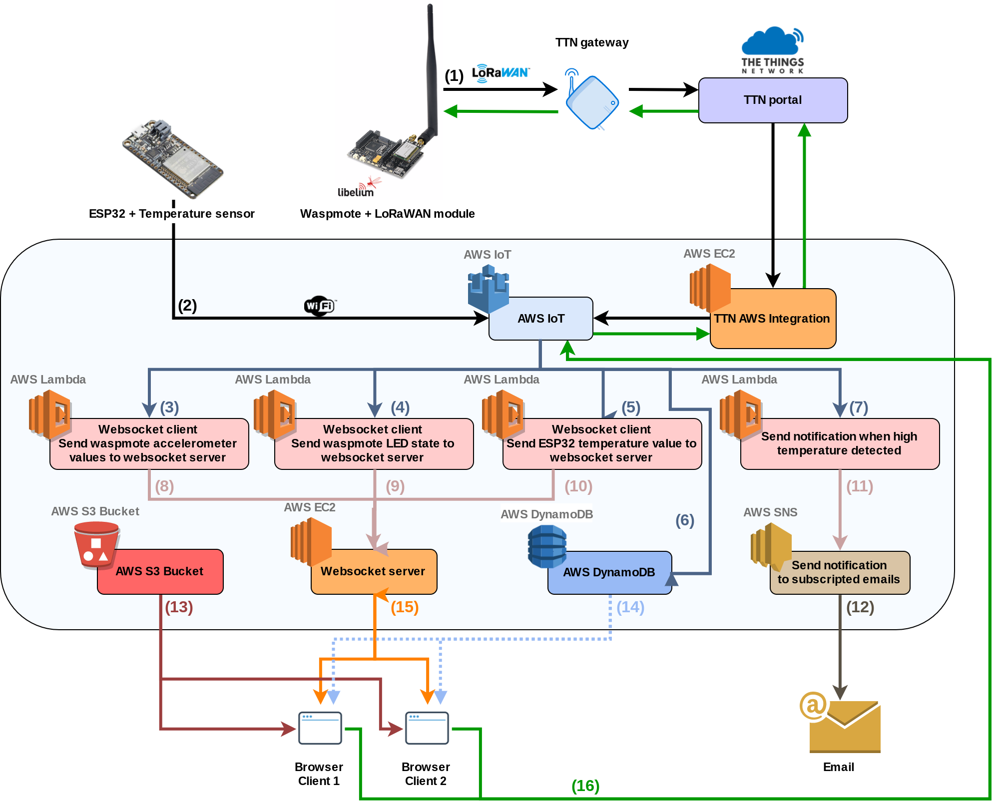
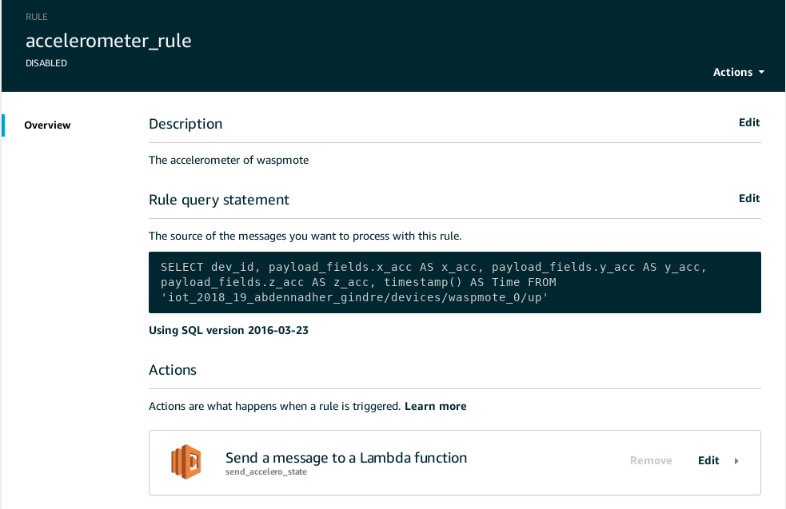
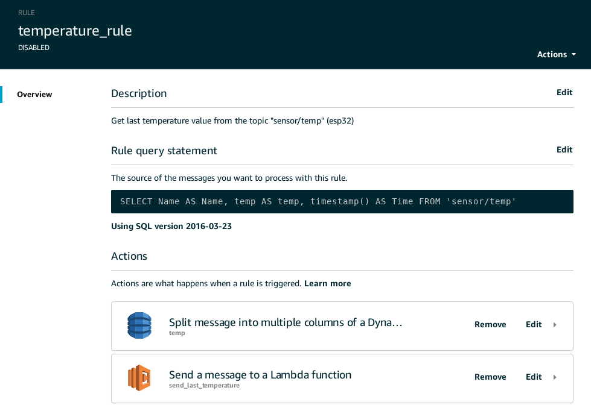
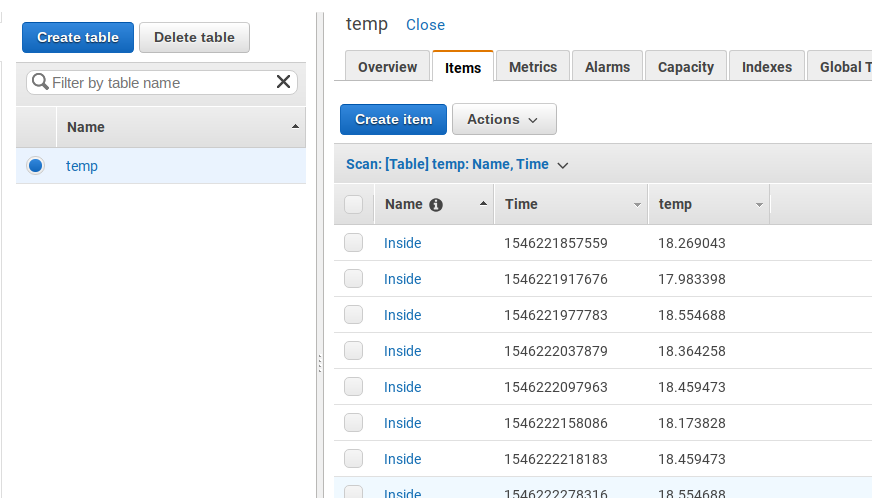
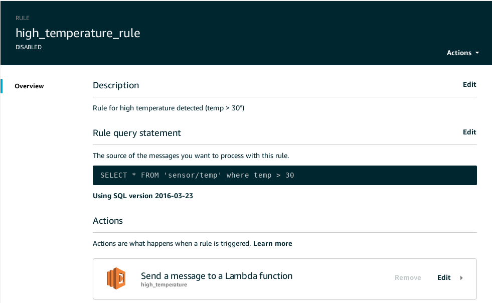
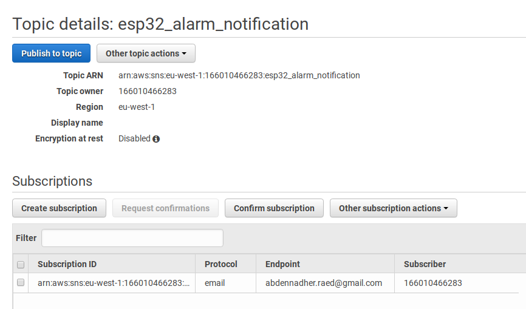
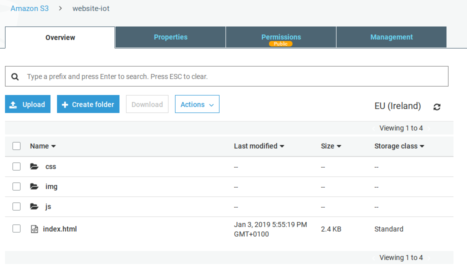
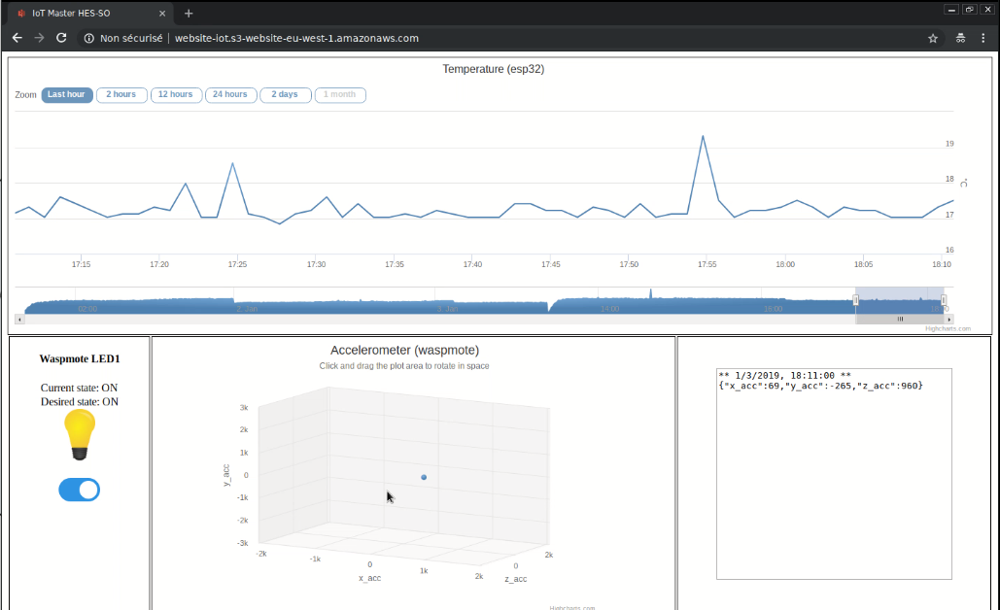

**(1) :** Message LoRaWAN envoyé par le waspmote à TTN (1 par 30 secondes) contenant 3 valeurs de l’accéléromètre (x, y et z) et l’état de la LED1 en hexadécimal. 

* Message en hexadécimal : 

  x : 16 bits, y 16 bits, z 16 bits et led state 8 bits. 

* Exemple :  `04 82 FF 97 00 5F 00 01`

* En arrivant dans le portail de TTN, ce message sera décodé (Payload Format decoder) et retourné en format JSON :

```json
{
    "led_state": 1, 
    "x_acc": 1154, 
    "y_acc": -105, 
    "z_acc": 95
}
```
**(2) :** Message MQTT envoyé par ESP32 (1 pat minute) contenant la valeur du capteur de température en degré Celsius. Exemple JSON :

```json
{
    "Name": "Inside", 
    "temp": 24.2
}
```
**(3) :** Lors de la réception de données du waspmote, une action est lancée avec la *Rule query statement* suivante (concerne l'accéléromètre) :

```mysql
SELECT dev_id, payload_fields.x_acc AS x_acc, payload_fields.y_acc AS y_acc, payload_fields.z_acc AS z_acc, timestamp() AS Time FROM 'iot_2018_19_abdennadher_gindre/devices/waspmote_0/up'
```

Cette action va lancer un script d'une fonction *Lambda* `send_accelero_state` qui recevera les données sous forme JSON. Exemple :

```json
{
    "dev_id": "waspmote_0", 
    "x_acc": 1154, 
    "y_acc": -105, 
    "z_acc": 95, 
    "Time": 1546533762406
}
```



**(4) :** Lors de la réception de données du waspmote, une autre action est lancée avec la *Rule query statement* suivante (concerne l'état de la LED) :

```mysql
SELECT payload_fields.led_state AS led_state FROM 'iot_2018_19_abdennadher_gindre/devices/waspmote_0/up'
```

Cette action va lancer un script d'une fonction *Lambda* `send_led_state` qui recevera les données sous forme JSON. Exemple :

```json
{
    "led_state": "1"
}
```


**(5) et (6) :** Lors de la réception de données du ESP32, une action est lancée avec la *Rule query statement* suivante (concerne la température) :

```mysql
SELECT Name AS Name, temp AS temp, timestamp() AS Time FROM 'sensor/temp'
```

Cette action va lancer un script d'une fonction *Lambda* `send_last_temperature` et va enregistrer les données dans une table `temp` DynamoDB qui receveront les données sous forme JSON. Exemple :

```json
{
    "Name": "Inside", 
    "temp": 24.2
}
```





**(7) :** Lors de la réception d'une température du ESP3 supérieure à 30°, une action est lancée avec la *Rule query statement* suivante (concerne la température) :

```mysql
SELECT * FROM 'sensor/temp' where temp > 30
```

Cette action va lancer un script d'une fonction *Lambda* `high_temperature` qui recevera les données sous forme JSON. Exemple :

```json
{
    "Name": "Inside", 
    "temp": 31.5
}
```



**(8) :** La fonction *Lambda* `send_accelero_state` envoie un message sous forme JSON via websocket sous la fomre suivante :

```json
{
    "action": "accelero", 
    "x_acc": "x_acc value", 
    "y_acc": "y_acc value", 
    "z_acc": "z_acc value", 
    "time": "time value"
}
```
**(9) :** La fonction *Lambda* `send_led_state` envoie un message sous forme JSON via websocket sous la fomre suivante :

```json
{
    "action": "led", 
    "state": "led state"
}
```
**(10) :** La fonction *Lambda* `send_last_temperature` envoie un message sous forme JSON via websocket sous la fomre suivante :

```json
{
    "action": "temp", 
    "temp": "temperature value",
    "time": "time value"
}
```
**(11) :** La fonction *Lambda* `high_temperature` envoie un message JSON sous la fomre du point 6 au service de notification *SNS* à la rubrique (*Topic*) `esp32_alarm_notification`

**(12) :** Dans la rubrique (*Topic*) on a une souscription (*Subscription*) via le protocol *email* pour envoyer un email à une addresse personnelle



**(13) :** On a configuré un site web statique dans le service *S3 Bucket*. Le lien vers ce site est le suivant: [http://website-iot.s3-website-eu-west-1.amazonaws.com/](http://website-iot.s3-website-eu-west-1.amazonaws.com/). En effectuant cette requette http, l'utilisateur recevra les fichiers html, js, css et images.



**(14) :** En chargeant la page `index` du site, un script js va soliciter la table `temp` de DynamoDB et récupérer toutes les températures enregistrées dans un diagramme (*Chart*).

```js
var dynamodb = new AWS.DynamoDB();
...
        dynamodb.query(params, function(err, data) {
            if (err) {
                logging(err);
                return reject(err);
            } 
            let dataTemp = [];
            for (var i in data['Items']) {
                TemperatureRead = parseFloat(data['Items'][i]['temp']['N']);
                TimeRead = parseFloat(data['Items'][i]['Time']['N']);
                dataTemp.push({
                    x: TimeRead,
                    y: TemperatureRead
                })
            }
            ...
        });
...
```




**(15) :** Le serveur Websocket (écrit Python dans une instance *EC2* avec une addresse ip élastique) diffuse les données reçus par les fonctions *Lambda* ainsi que l'action de changement de l'état de la LED, pour actualiser l'affichage des page html ouvertes de tous les clients :

```pseudocode
according to the value of the key 'action' of the received message:
	'led'			=> broadcast {'type': 'led', 'state': state}
	'temp'			=> broadcast {'type': 'temp', 'temp': temp, 'time': time}
	'accelero'		=> broadcast {'type': 'accelero', 'x_acc': x_acc, 'y_acc': y_acc, 
									'z_acc': z_acc, 'time': time}
	'requestState'	=> broadcast {'type': 'pending', 'desiredState': state}
```

**(16) :** Quand l'utilisateur demande le changement de l'état de la LED (en cliquant sur le check button), deux actions vont se produire :

1. Envoyer un message JSON au serveur websocket sous la forme suivante :

   ```json
   {"action": "requestState", "state": desiredLedState}
   ```

2. Publier un message à *AWS IoT*  (*DownLink*)

```js
var iotdata = new AWS.IotData({endpoint: 'a72x50k0riqjj-ats.iot.eu-west-1.amazonaws.com'});
...
// Event handler for changing LED state request by checking/unchecking the checkbox
function changeLedStateRequest(checkbox) {
    desiredLedState = "0";
    if (checkbox.checked) {
        desiredLedState = "1";
    }
    websocket.send(JSON.stringify({action: "requestState", state: desiredLedState}));
    publish();
}

// Publish a downlink
function publish() {
    let payloadJson = '{"port": 1,"confirmed": false,"payload_raw": "' + btoa(desiredLedState) + '"}',  /* btoa convert string to base64 */
        waspmoteTtnTopic = 'iot_2018_19_abdennadher_gindre/devices/waspmote_0/down';
    let params = {
        topic: waspmoteTtnTopic,
        payload: payloadJson,
        qos: 0
    };
    iotdata.publish(params, function(err, data) {
        if (err) {
            // an error occurred
            logging(err.stack);
        } else {
            // successful response
            logging("publish: " + payloadJson + " to topic: " + waspmoteTtnTopic);
        }
    });
}
```

